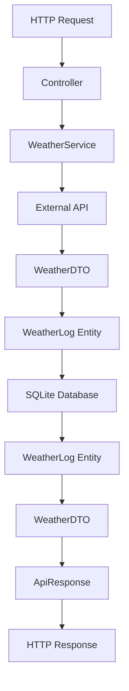

# 🏗️ MVC Architecture Guide - Weather API

## 📋 **Arquitetura Correta: Models vs Entities**

### **Sim, AMBOS são necessários! Aqui está o porquê:**

## 🎯 **Separação de Responsabilidades:**

### **📦 Models (`/src/models/`):**
```typescript
// WeatherModels.ts
- WeatherDTO        → Data Transfer Object (comunicação entre camadas)
- ApiResponse       → Padronização de respostas HTTP  
- OpenWeatherAPI    → Interface para APIs externas
```

**Responsabilidades:**
- ✅ Estruturas de dados para comunicação
- ✅ Transformação e formatação de dados
- ✅ Tipagem de contratos de API
- ✅ Validação de entrada/saída

### **🗄️ Entities (`/src/entities/`):**
```typescript
// WeatherLog.ts
- WeatherLog        → Mapeamento objeto-relacional com TypeORM
- @Entity decorators → Configuração de tabela do banco
- Hooks de DB       → @BeforeInsert, @AfterInsert
```

**Responsabilidades:**
- ✅ Mapeamento de tabelas do banco de dados
- ✅ Validação de persistência
- ✅ Relacionamentos entre tabelas
- ✅ Hooks de ciclo de vida do banco

---

## 🔄 **Fluxo de Dados Completo:**



### **Exemplo Prático:**

```typescript
// 1. Controller recebe requisição
@Get('/weather/:city')
async getWeather(req, res) {
    // 2. Service processa com DTO
    const weatherDTO = await WeatherService.getWeather(city);
    
    // 3. Service persiste com Entity
    const entity = weatherDTO.toEntity();
    await repository.save(entity);
    
    // 4. Controller retorna ApiResponse
    res.json(ApiResponse.success(weatherDTO.toJSON()));
}

// 5. Service busca histórico
async getHistory(city) {
    // Busca entities do banco
    const entities = await repository.find({city});
    
    // Converte entities para DTOs
    return entities.map(entity => WeatherDTO.fromEntity(entity));
}
```

---

## 📚 **Métodos de Conversão Implementados:**

### **Model → Entity (para salvar no banco):**
```typescript
const dto = new WeatherDTO('London', '20°C', '65%', 'Sunny');
const entity = dto.toEntity(); // Converte para WeatherLog
await repository.save(entity);
```

### **Entity → Model (para retornar da API):**
```typescript
const entity = await repository.findOne({city: 'London'});
const dto = WeatherDTO.fromEntity(entity); // Converte para DTO
return ApiResponse.success(dto.toJSON());
```

---

## 🎪 **Benefícios desta Arquitetura:**

### **🚀 Separação Limpa:**
- **Models**: Regras de negócio e comunicação
- **Entities**: Persistência e banco de dados
- **Controllers**: HTTP e routing
- **Services**: Orquestração e lógica complexa

### **🔧 Manutenibilidade:**
- Mudanças no banco não afetam a API
- Mudanças na API não afetam o banco
- Reutilização de DTOs em diferentes contextos
- Validação isolada por camada

### **🧪 Testabilidade:**
- Mock de DTOs independente do banco
- Teste de persistência isolado
- Validação de contratos de API
- Testes unitários por camada

---

## 📁 **Estrutura Final do Projeto:**

```
src/
├── 📂 controllers/     # HTTP handlers (Controller layer)
│   └── WeatherController.ts
├── 📂 services/        # Business logic (Service layer)  
│   └── WeatherService.ts
├── 📂 models/          # DTOs e API contracts (Model layer)
│   └── WeatherModels.ts
├── 📂 entities/        # Database mapping (Entity layer)
│   └── WeatherLog.ts
├── 📂 decorators/      # Route & validation decorators
├── 📂 middlewares/     # Express middlewares
├── 📂 routes/          # Route definitions
└── 📂 config/          # Configuration & setup
```

---

## ✅ **Conclusão:**

**SIM, precisamos de AMBOS:**
- **Models** = Comunicação e lógica de negócio
- **Entities** = Persistência e banco de dados

Esta separação garante:
- 🎯 **Responsabilidade única** para cada camada
- 🔄 **Conversão controlada** entre formatos
- 🛡️ **Validação apropriada** em cada contexto
- 🚀 **Escalabilidade** e manutenibilidade

**A arquitetura está CORRETA e COMPLETA!** 🎉
